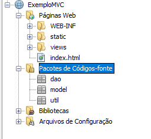

# ETB - Linguagem Técnica de Programação 3 🖥️📚

Este repositório contém links para os repositórios individuais das aulas e projetos realizados na disciplina **Linguagem Técnica de Programação 3**. Abaixo estão as aulas, atividades, bem como o projeto da A2, com descrições detalhadas e links para os respectivos repositórios.

## Conteúdo das Aulas 📘

* **[Aula 2 - JSP](https://github.com/alineop120/aula-jsp)**
   - **Descrição**: Aula sobre JSP (Java Server Pages) e seu uso no desenvolvimento de páginas dinâmicas.
   
* **[Aula 3 - Exemplo MVC](https://github.com/alineop120/exemplo-mvc)**
   - **Descrição**: Implementação de um exemplo básico do padrão MVC (Model-View-Controller) em Java.
   - 

* **[Aula 4 - Servlets](https://github.com/alineop120/aula-servlet)**
   - **Descrição**: Implementação de Servlets para criar aplicações web baseadas em Java.

* **[Aula 5 - JSTL](https://github.com/alineop120/aula-jstl)**
   - **Descrição**: Aula sobre a utilização de JSTL (JavaServer Pages Standard Tag Library) para manipulação de dados em páginas JSP.

---

## Projetos 🛠️

* **[Projeto - Revisão HTML e CSS](https://github.com/alineop120/projeto-recipe-main)**
    - **Descrição**: Revisão prática de HTML e CSS, com foco no desenvolvimento de páginas web responsivas.
    - **Data de entrega**: 27/02/2025

* **[Projeto A2 - Sistema Cadastro de Pessoas](https://github.com/alineop120/projeto-a2-sistema-cadastro-de-pessoas)**
   - **Descrição**: Desenvolvimento de um sistema completo para cadastro de pessoas, utilizando conceitos das aulas anteriores.
   - **Data de entrega**: Não definida.

---

## Sites recomendados pelo professor 🌐

Aqui estão alguns sites recomendados para aprendizado adicional e bibliotecas úteis mencionadas em aula:

- **[Front-end Mentor](https://www.frontendmentor.io/)**: Plataforma para praticar habilidades de front-end com desafios reais.
- **[MVN Repository](https://mvnrepository.com/)**: Repositório de bibliotecas Java, onde você pode encontrar dependências para seus projetos.
  - **Biblioteca recomendada**: [BCrypt](https://mvnrepository.com/artifact/org.mindrot.bcrypt/bcrypt/0.3) - útil para hashing de senhas.
  - **Biblioteca recomendada**: [MySQL](https://mvnrepository.com/artifact/mysql/mysql-connector-java) - Conector JDBC para MySQL.

---